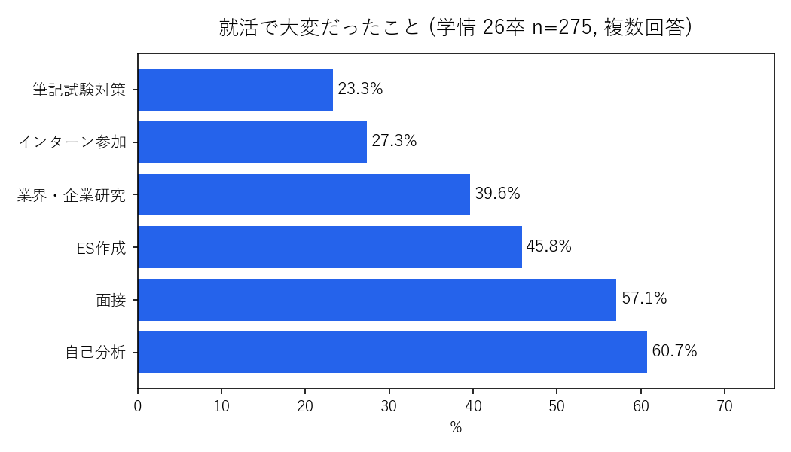
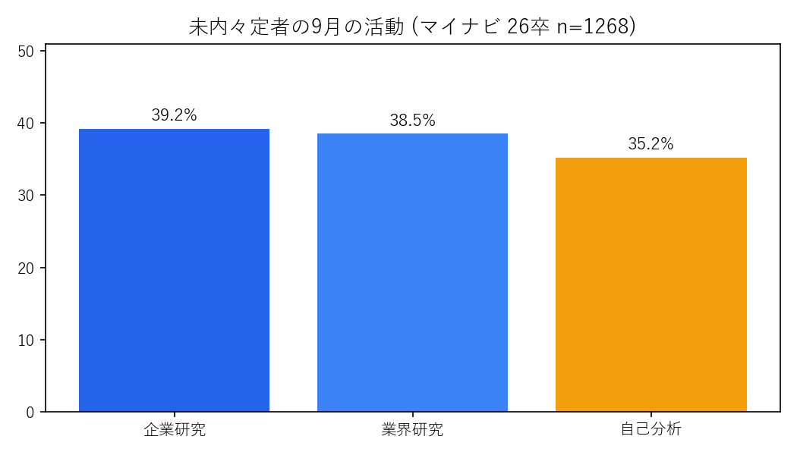

# 自己分析データ集（全数値・出典付き）

## 1. 学情 26卒 275名（2025.8.20-9.2）
- 大変だったこと: 自己分析60.7%, 面接57.1%, ES45.8%, 業界・企業研究39.6%, インターン27.3%, 筆記23.3%
- 頑張って良かった: 自己分析46.5%, 面接対策42.5%, ES31.3%, 業界研究31.3%
- 出典: https://service.gakujo.ne.jp/wp-content/uploads/2025/09/250930-navienq.pdf

## 2. dodaキャンパス 317名（2026.6.23-30）/ 239名（2026.4.3-8）
- ESで最も重要: 自己分析42.6%
- 自己PRは自己分析をもとに41%
- 開始時期: 3年4-6月35%（＝65%は夏以降）
- 手法: ツール30%, 自分史21%, MBTI10%
- 社会人124名: 入社後ギャップ40%
- 出典: https://campus.doda.jp/career/self-analysis/000335.html

## 3. マイナビ 26卒 1268名（2025.9.23-27）
- 未内々定者の9月活動: 企業研究39.2%, 業界研究38.5%, 自己分析35.2%
- 出典: https://career-research.mynavi.jp/reserch/20251010_103406/

## 4. Synergy Career 26・27卒 200名（2025.11.19-23）
- 適職診断経験53.0%（0回47%, 1回17%, 2-4回20%, 5-9回10%, 10回以上6%）
- 自己イメージ一致58.3%, 信頼できる30.5%, どちらともいえない42.0%
- 業界選びに影響36.8%
- 出典: https://prtimes.jp/main/html/rd/p/000000069.000065508.html

## 5. 就職白書2026（就職みらい研究所）
- 企業1182社: 採用基準「人柄」重視93.8%
- 学生1326人: アピール アルバイト46.1%, 人柄40.9%
- AI利用840人: 自己分析57.1%, 自己PR55.4%
- 出典: https://jbrc.recruit.co.jp/common/images/mirai/uploads/2026/02/hakusho2026_data.pdf
- 解説: https://kigyobunseki.com/column/jiko-bunseki-dekinai

## 問題定義一文
> 本来は全員が十分な自己理解で挑むべきにもかかわらず、やり方とゴールが分からないために、6割が苦戦したまま選考に進んでしまうことが問題である。
